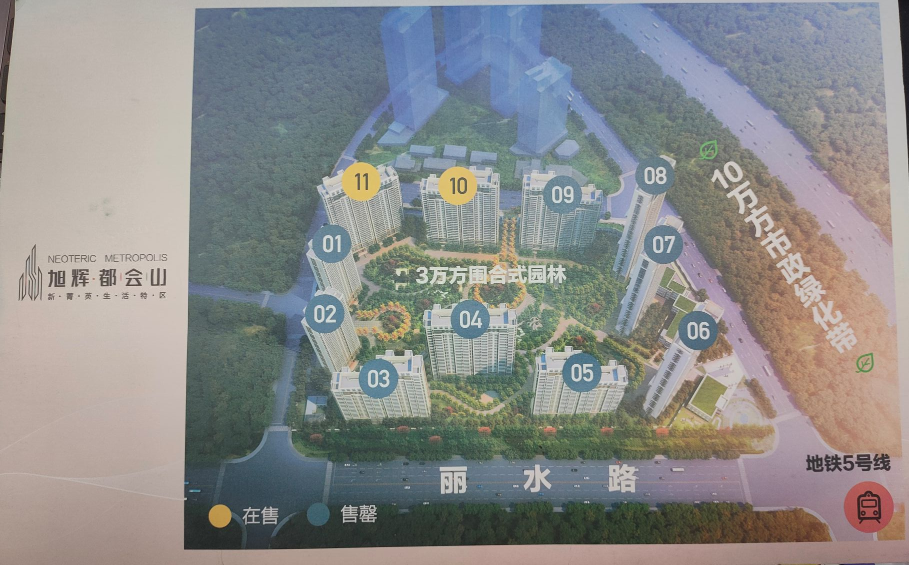
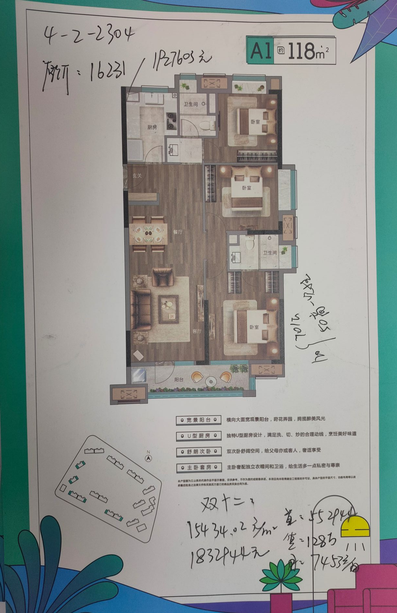

***

看房要点：

 - 采光，不止是光线，而是太阳光直射的时长

 - 方位，光线也可通过判断方位来评估，有现房或者楼已开始在建的话，直接去看实物，使用手机指南针判断方位，应该让阳台窗户有对着南向（就湖北而言，面向南方，太阳应该是在面前的从动到西，而不是正头顶的从东到西）

 - 楼层，选择中等偏上，但除去楼顶1-2层的位置，有介意高层的也尽量选择总层数的1/4以上处。这样不管是采光还是风景还是噪音都可以有一定的保障。举个例子：40层的楼，理想选择25-38，想要低也不要低于10层（长辈比较介意的会有带4的楼层，因为迷信有谐音）

 - 还有比较重要的几个需要关注的指标：

   - ①单价，没钱的我还是比较重视这点的，好在总价还跟面积有关，所以需要自己权衡，户型和单价(基本挂钩地理位置)这两个因素的了。举个例子：想要单价好的地方，那就买小面积的。
   - ②户型，个人想要三房两卫；
   - ③车位比，低于1，还是不太ok的叭？
   - ④容积率，2.* - 4.* 就好了有条件越低越好。1.* 属于别墅型，5.* 我觉得像畜牧。但是现在开发商都想用有限的土地赚无限的金钱，超高层楼多了，容积率都在3.* -4.* 之间

 - 周边

   根据事件发生的概率，以下的几点就是我的考虑顺序

   - 教育，幼、小、中、高。幼儿园现在小区都会有配套，着重小学、中学<考虑二手房，就要问学位有没有使用>。高中，虽然是选拔考试，但是有新老城区之分，介意的也可以参考，丹我觉得孩子高中那是20年以后的事了，我管不着。
   - 交通，地铁、公交、驾车出行，都要考虑。我重点考虑的驾车出行，地铁、公交次之。（提醒：同片区离地铁距离越近，市场价值越好，出门200米就是地铁，和地铁距离1.5公里，房价是有蛮差别的）
   - 医疗，医疗我觉得周边有像样的大医院就行，总不至于只有个诊所叭？至于三甲医院，驾车半小时内有到的就可以了
   - 生活，商场、银行、超市等都算叭，把菜市场也算上？好像还没有哪个楼盘说自己没有商圈的，也基本像幼儿园一样自带，主要看人气，所以关键还是看2点：①小区入住够不够，②周边楼盘多不多。人多了<入住的人要够多>，这些做生意的人会放着钱不赚吗？
   - 休闲，公园、体育馆等，可能我是一个并不太注重生活品质的人，周边怎样都不影响我跑步休闲好像......，当然，有的小区自带人车分流跑道，恒温游泳池，旁边就是公园江滩什么的，也确实比较舒服。这个指标我称之为，条件允许可以要的，不强求指标。

- 开发商，物业这块，能讲究就讲究一下，连恒大都倒了，还有什么不可能。适当考虑，不太作重点，也不是完全不考虑啊，有的已经明显有风险，老板跑路的，还是要慎重一点把

几个注意事项：

- 信息查证：[房管局](http://fgj.wuhan.gov.cn/bsfw_44/)可以查到土地征收，规划，楼盘备案，每栋楼每层每户的销售情况，不要听信销售的鬼话。
- 单价，备案价肯定比销售价高，能讲的讲讲价，销售总会有办法降价的。
- 通常楼盘都有以老带新的活动，不要随便把自己的姓名和电话给中介的人。可以问楼盘的销售。
- 二手房未满二的，税费可有点高。

****

看过的几个楼盘信息：

[旭辉都会山-(广申房地产)](http://fgj.wuhan.gov.cn/bsfw_44/zxsbhcxxt/spfxm/)：单价15.4k，总价180w，近三环，近地铁，五号线已通车，配套小学残破不堪，菜市场拆迁受阻，对面有个拘留所。

金地兰亭大境

美的君兰半岛

保利上城

景瑞天赋滨江

